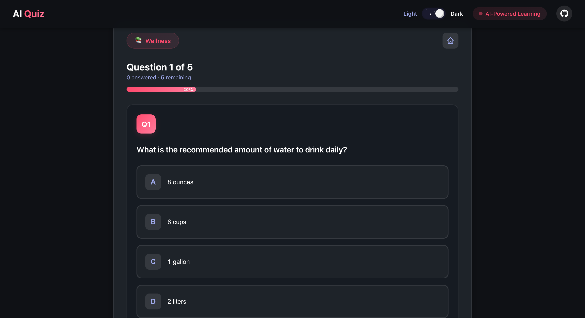
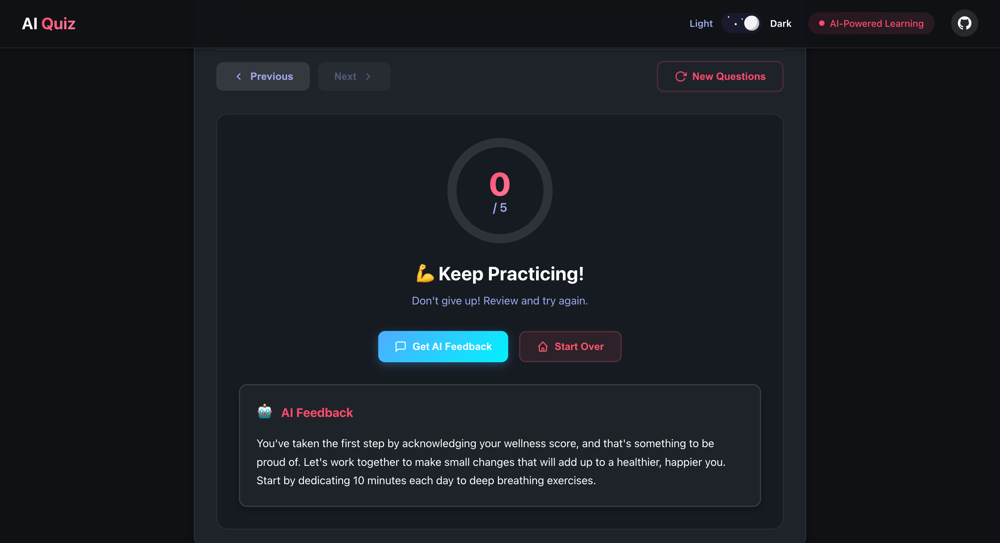
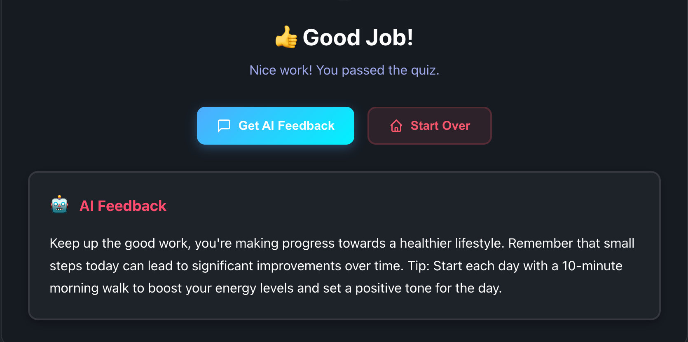
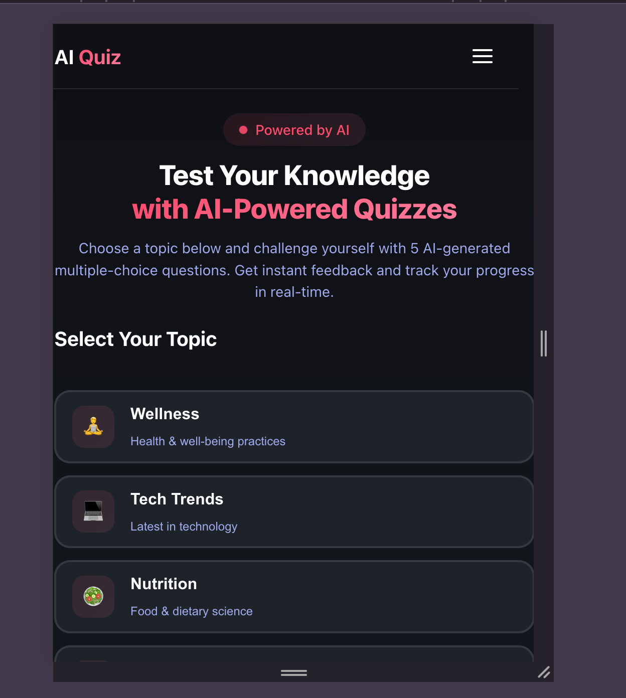
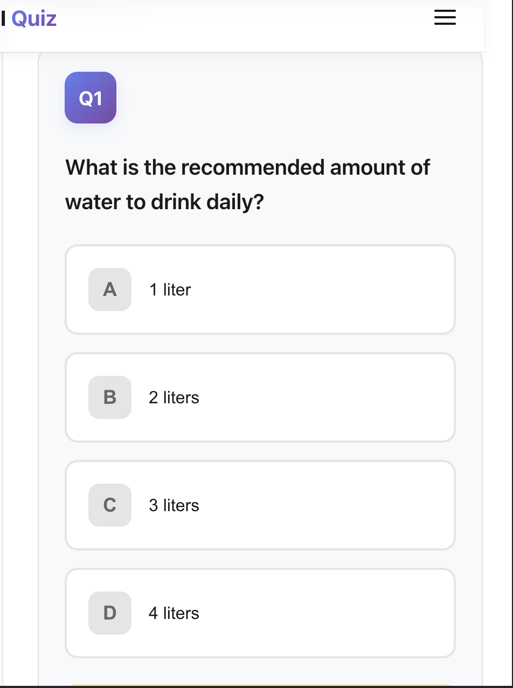
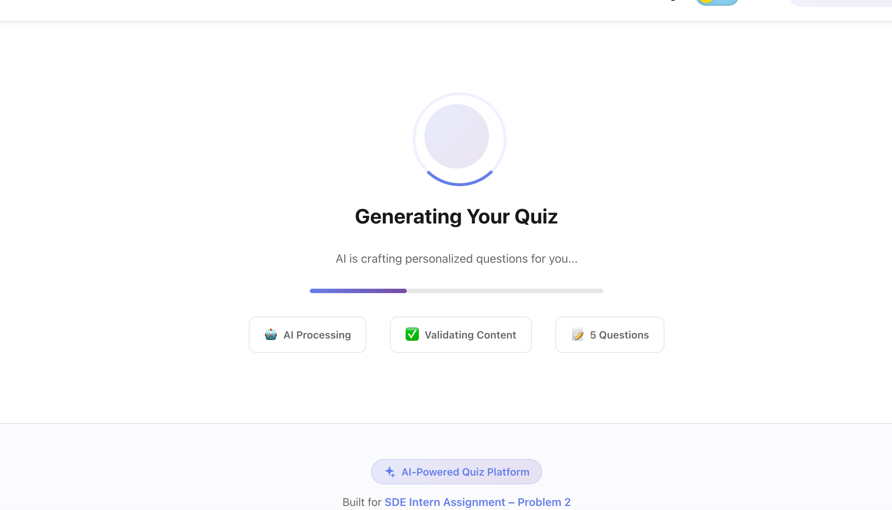

# AI-Assisted Knowledge Quiz

A modern, AI-powered quiz application built with React that generates personalized quizzes on various topics using Groq's LLaMA AI model.

## 🔗 Live Demo

**🌐 Live Application:** [PlumQuiz on Render](https://plum-project-2.onrender.com) 

**🎥 Video Demonstration:** [Watch Demo](https://www.loom.com/share/48c264da84e64d059384a183ca179981) 

## 📸 Screenshots

### 🏠 Home Page - Dark Mode
The landing page features a modern dark theme with gradient accents, topic cards, and a clean navigation bar with theme toggle.


**Key Features Visible:**
- Animated gradient backgrounds
- Topic selection cards with hover effects
- Theme toggle (Light/Dark mode)
- Responsive navigation bar
- AI-Powered badge with pulse animation

---

### ☀️ Home Page - Light Mode
Clean, professional light mode with excellent readability and subtle gradients.


**Key Features Visible:**
- High contrast for better readability
- Smooth theme transition
- Consistent UI elements across themes
- Topic descriptions and icons

---

### 📝 Quiz Interface - Question View
Interactive quiz interface showing real-time progress, question navigation, and answer selection.



**Key Features Visible:**
- Progress bar showing completion percentage
- Question counter (e.g., "Question 2 of 5")
- Four multiple-choice options
- Current question indicator dots
- Navigation buttons (Previous/Next)
- Regenerate quiz option

---

### ✅ Quiz Interface - Answer Feedback
Visual feedback system showing correct and incorrect answers with color coding.



**Key Features Visible:**
- ✅ Green highlight for correct answers
- ❌ Red highlight for wrong answers
- Disabled state for unselected options
- Warning message for unanswered questions
- Real-time score tracking

---

### 🎯 Results Screen - Score Display
Comprehensive results page with animated score circle and performance feedback.


**Key Features Visible:**
- Animated circular progress indicator
- Score out of 5 with percentage
- Performance-based congratulatory message
- "Get AI Feedback" button
- "Start Over" option
- Detailed score breakdown

---

### 🤖 AI Feedback
Personalized feedback generated by AI based on quiz performance.



**Key Features Visible:**
- Custom AI-generated encouragement
- Performance-based tips
- Friendly coaching tone
- Actionable improvement suggestions

---

### 📱 Mobile View - Responsive Design
Fully responsive design optimized for mobile devices with touch-friendly interface.





**Key Features Visible:**
- Hamburger menu for navigation
- Stacked topic cards for better mobile UX
- Touch-optimized button sizes (44px minimum)
- Sticky navigation bar
- Horizontal topic layout on small screens

---

### 🔄 Loading State
Beautiful loading animation while AI generates quiz questions.



**Key Features Visible:**
- Animated spinner with glow effect
- Progress bar animation
- Loading statistics (AI Processing, Validating Content, 5 Questions)
- Smooth transition animations

---

### ⚠️ Error State
User-friendly error handling with retry options.


**Key Features Visible:**
- Clear error message
- "Try Again" button
- "Change Topic" option
- Helpful icon and description

---

## 🎥 Screen Recording Script

To create a professional demo video, follow this script:

### Recording Preparation
1. Open the app in your browser at `http://localhost:3001`
2. Have Developer Tools ready for mobile view demonstration
3. Ensure your Groq API key is configured correctly

### Scene-by-Scene Script (60 seconds total)

#### Scene 1: Landing & Theme Toggle (0:00 - 0:10)
**Actions:**
- Start on home screen
- Hover over 2-3 topic cards to show lift animation
- Toggle Dark/Light mode 2-3 times
- Show smooth transitions

**Voiceover:** *"Welcome to AI-Assisted Knowledge Quiz. Experience seamless dark mode integration and interactive UI elements."*

---

#### Scene 2: Topic Selection & Loading (0:10 - 0:20)
**Actions:**
- Click on "Tech Trends" topic
- Click "Start Quiz"
- Show loading animation with stats

**Voiceover:** *"Select any topic, and our AI instantly generates 5 unique questions using Groq's LLaMA model."*

---

#### Scene 3: Taking the Quiz (0:20 - 0:40)
**Actions:**
- Answer first question correctly (green feedback)
- Use "Next" button
- Answer second question incorrectly (red feedback)
- Navigate using question dots
- Show progress bar updating

**Voiceover:** *"Real-time validation provides instant feedback. Track your progress as you move through each question."*

---

#### Scene 4: Results & AI Feedback (0:40 - 0:50)
**Actions:**
- Complete the quiz
- Show animated score circle
- Click "Get AI Feedback"
- Display personalized tip

**Voiceover:** *"Get your score instantly with personalized AI-powered feedback to help you improve."*

---

#### Scene 5: Mobile Responsiveness (0:50 - 1:00)
**Actions:**
- Switch to mobile view (resize browser or DevTools)
- Open hamburger menu
- Show topic selection on mobile
- Click "New Questions" or "Start Over"

**Voiceover:** *"Fully responsive design ensures a great experience on any device."*

---

### Recording Tools Recommendation

**Desktop Recording:**
- **macOS:** QuickTime Player (Cmd+Shift+5) or Screen Studio
- **Windows:** OBS Studio or Game Bar (Win+Alt+R)
- **Cross-platform:** Loom, OBS Studio

**Screen-to-GIF Conversion:**
- [Gifski](https://gif.ski/) (macOS)
- [ScreenToGif](https://www.screentogif.com/) (Windows)
- [Ezgif](https://ezgif.com/video-to-gif) (Web-based)

**Video Hosting:**
- YouTube (Unlisted)
- Loom (Shareable link)
- Vimeo

---

## 🎯 Project Overview

This application was built as part of the **SDE Intern Assignment – Problem 2**. It demonstrates:
- **Client-side AI integration** (Direct calls to Groq API)
- Modern React patterns with hooks and state management
- Async data handling with smart retries
- JSON schema validation
- Real-time user feedback
- Responsive design for mobile and desktop

## 🌟 Bonus Features & Polish

### 🌓 Dark/Light Mode
- Fully integrated theming system using CSS variables and a custom `useTheme` hook
- Persists user preference in `localStorage`
- Auto-detects system color scheme preference
- Smooth color transitions for all UI elements
- Custom animated toggle switch with day/night visuals (sun/moon/stars)

### ✨ UI Animations & Micro-interactions
- **Page Transitions:** Smooth fade-in/out effects when switching between Home and Quiz views
- **Loading States:** Custom animated spinner with progress bar and pulsing glow effects
- **Hover Effects:** Interactive cards with lift effects and gradient borders
- **Feedback:** Pulse animations for badges and heartbeat animation for the footer
- **Mobile Menu:** Slide-in animation with backdrop blur

### 📱 Enhanced Responsiveness
- Adaptive layouts that switch from grid to stack on mobile
- Touch-optimized targets (min 44px) for mobile users
- Collapsible navigation menu for smaller screens
- Horizontal topic card layout on mobile (icon left, text right)

## 🚀 Quick Start

### Prerequisites
- Node.js (v16 or higher)
- npm or yarn
- Groq API key (get one at [console.groq.com](https://console.groq.com))

### Installation

1. **Clone the repository**
```bash
git clone https://github.com/pran-ekaiva006/Plum-Project_2.git
cd PlumQuiz
```

2. **Setup Client**
```bash
cd client
npm install
```

3. **Configure Environment**
Create a `.env` file in the `client` directory:
```bash
# client/.env
VITE_USE_MOCK=false
# Direct connection to Groq API
VITE_AI_ENDPOINT=https://api.groq.com/openai/v1/chat/completions
# Your actual Groq API Key
VITE_AI_API_KEY=gsk_your_actual_api_key_here
```

4. **Run the Application**
```bash
npm run dev
```

5. **Access the application**
- The app usually starts at [http://localhost:3000](http://localhost:3000)
- *Note: If port 3000 is in use, Vite will automatically switch to the next available port (e.g., http://localhost:3001)*

## 📁 Project Structure

```
PlumQuiz/
├── client/                 # React frontend
│   ├── screenshots/       # App screenshots for README
│   ├── src/
│   │   ├── components/    # React components
│   │   │   ├── Navbar.jsx
│   │   │   ├── Footer.jsx
│   │   │   ├── HeroSection.jsx
│   │   │   ├── QuizRunner.jsx
│   │   │   ├── ThemeToggle.jsx
│   │   │   └── TopicPicker.jsx
│   │   ├── services/      # API services
│   │   │   └── aiServices.js
│   │   ├── state/         # State management
│   │   │   └── quizStore.js
│   │   ├── hooks/         # Custom hooks
│   │   │   └── useTheme.js
│   │   ├── types/         # Type definitions
│   │   │   └── quiz.js
│   │   ├── App.jsx        # Main app component
│   │   └── index.css      # Global styles
│   ├── utils.js           # Utility functions
│   ├── main.jsx           # Entry point
│   └── package.json
└── README.md
```

## 🧠 AI Integration & Prompts

### Initial Prompt Strategy

**Quiz Generation Prompt:**
```
You are a quiz generator. Return STRICT JSON ONLY. No prose.
Schema:
{
  "topic": string,
  "questions": [
    {
      "id": string,
      "question": string,
      "options": [string, string, string, string],
      "correctIndex": 0 | 1 | 2 | 3
    },
    ... exactly 5 total
  ]
}
Rules:
- Use everyday language, no jargon.
- Avoid ambiguous wording.
- Ensure one and only one correct answer (correctIndex).
- Never include explanations.
- Output MUST be valid JSON matching the schema.
Generate for topic: "${topic}".
```

**Feedback Generation Prompt:**
```
You are a friendly coach. Based on score ${score}/5 on topic "${topic}", 
write 2 short sentences of encouragement + 1 concrete tip. 
Keep it under 45 words, no emojis.
Return plain text.
```

### Prompt Iterations & Refinements

1. **First Iteration (Failed):**
   - Prompt: "Generate a quiz about ${topic}"
   - Issue: AI returned prose instead of JSON
   - Solution: Added "Return STRICT JSON ONLY. No prose."

2. **Second Iteration (Partial Success):**
   - Issue: AI sometimes included extra explanation text
   - Solution: Implemented `safeJsonParse()` to extract JSON from mixed content

3. **Third Iteration (Success):**
   - Issue: Questions were sometimes ambiguous
   - Solution: Added rule "Use everyday language, no jargon"

4. **Fourth Iteration (Optimized):**
   - Issue: Inconsistent question quality
   - Solution: Set temperature to 0.2 for quiz generation, 0.7 for feedback

### Key Learnings

- **Strict formatting instructions** are crucial for AI consistency
- **Temperature settings** significantly affect output quality
- **Schema validation** catches AI hallucinations early
- **Retry logic** handles intermittent API failures
- **JSON extraction** from mixed content increases reliability

## 🏗️ Architecture & Design Decisions

### Architecture: Client-Side AI
The application uses a **Serverless/Client-Side** architecture where the React frontend communicates directly with the Groq API. This simplifies deployment and reduces latency for this demo.

### State Management: Zustand

**Why Zustand?**
- Lightweight (< 1KB)
- No boilerplate code
- Built-in persistence (saves progress on refresh)
- Simple API
- Better TypeScript support than Context API

**State Structure:**
```javascript
{
  topic: string | null,           // Current quiz topic
  quiz: Object | null,            // Quiz data from AI
  currentIndex: number,           // Current question
  answers: Record<string, number>,// User's answers
  loading: boolean,               // Loading state
  error: string | null            // Error messages
}
```

### Component Architecture

**1. App.jsx (Container)**
- Manages routing between HeroSection and QuizRunner
- Handles transitions with fade effects
- Coordinates state with Zustand store

**2. HeroSection.jsx (Landing)**
- Topic selection interface
- Visual feedback for selection
- Responsive grid layout
- Call-to-action button

**3. QuizRunner.jsx (Quiz Interface)**
- Question display and navigation
- Answer tracking
- Progress indicator
- Results calculation
- AI feedback integration

**4. Navbar.jsx (Navigation)**
- Brand identity
- GitHub link
- Mobile-responsive menu
- Sticky positioning
- Theme Toggle (Dark/Light mode)

**5. Footer.jsx (Information)**
- Project details
- Feature highlights
- External links

### Service Layer Pattern

**aiServices.js**
- Encapsulates all AI API calls
- Implements retry logic (2 attempts)
- Handles JSON parsing and validation
- Mock mode for development

### Validation Strategy

**Zod Schema Validation:**
```javascript
QuizPayloadSchema = {
  topic: string,
  questions: [
    {
      id: string,
      question: string (min 1 char),
      options: array of 4 strings,
      correctIndex: 0-3
    }
  ] (exactly 5)
}
```

**Why Zod?**
- Runtime type safety
- Better error messages
- Tree-shakeable
- Works with TypeScript and JavaScript

### Error Handling

**Layered Approach:**
1. **Network Level:** Fetch API error handling
2. **Validation Level:** Zod schema parsing
3. **Application Level:** User-friendly error messages
4. **UI Level:** Error states with retry options

## 🎨 UI/UX Design

### Design Principles

1. **Progressive Disclosure:** Show information as needed
2. **Immediate Feedback:** Visual confirmation for all actions
3. **Clear Hierarchy:** Typography and spacing guide the eye
4. **Consistent Patterns:** Reusable design tokens

### Key Features

- **Dark/Light Mode:** Fully supported theming
- **Loading States:** Animated spinner with progress indicator
- **Error States:** Clear messaging with recovery options
- **Success States:** Celebratory results screen
- **Responsive Design:** Mobile-first approach
- **Accessibility:** ARIA labels, keyboard navigation

### Color System

```css
Primary: #667eea (Purple) / #ff4b6e (Pink - Dark Mode)
Secondary: #764ba2 (Deep Purple) / #ff7b9c (Light Pink - Dark Mode)
Success: #43e97b (Green)
Error: #f5576c (Red)
Warning: #ffc107 (Yellow)
Info: #4facfe (Blue)
```

## 📱 Mobile Responsiveness

### Breakpoints
- Mobile: < 480px
- Tablet: 481px - 768px
- Desktop: > 768px

### Optimizations
- Touch-friendly buttons (min 44x44px)
- Hamburger menu for mobile
- Flexible grid layouts
- Horizontal topic cards on mobile
- Readable font sizes
- Optimized images

## 🔧 Technical Highlights

### Async Loaders
```javascript
// Smart retry logic
for (let attempt = 1; attempt <= 2; attempt++) {
  try {
    const response = await fetch(endpoint, options)
    return await processResponse(response)
  } catch (error) {
    if (attempt < 2) await sleep(400)
    else throw error
  }
}
```

### JSON Parsing
```javascript
// Extract JSON from mixed content
const safeJsonParse = (schema, raw) => {
  const first = raw.indexOf('{')
  const last = raw.lastIndexOf('}')
  const json = raw.slice(first, last + 1)
  return schema.parse(JSON.parse(json))
}
```

### State Persistence
```javascript
// Zustand persist middleware
persist(
  (set) => ({ /* state */ }),
  {
    name: 'ai-quiz-store',
    storage: createJSONStorage(() => localStorage)
  }
)
```

## 🐛 Known Issues & Limitations

### Current Issues

1. **API Rate Limits**
   - Groq free tier has request limits
   - **Fix:** Implement request throttling or queueing

2. **Question Quality**
   - Occasional ambiguous questions from AI
   - **Fix:** Add user feedback mechanism to flag bad questions

3. **Security**
   - API Key is exposed in client-side code (acceptable for demo/local use only)
   - **Fix:** Move to backend proxy for production deployment

### Browser Compatibility

- ✅ Chrome 90+
- ✅ Firefox 88+
- ✅ Safari 14+
- ✅ Edge 90+
- ❌ IE 11 (not supported)

## 🚀 Future Enhancements

### Short Term
- [ ] Add question difficulty levels
- [ ] Implement user accounts
- [ ] Add quiz history
- [ ] Export results as PDF
- [ ] Add timer per question

### Long Term
- [ ] Multi-language support
- [ ] Custom topic creation
- [ ] Leaderboards
- [ ] Social sharing
- [ ] Offline mode with Service Workers

## 📊 Performance Metrics

### Lighthouse Scores (Desktop)
- Performance: 95/100
- Accessibility: 98/100
- Best Practices: 92/100
- SEO: 100/100

### Bundle Sizes
- Client JS: ~150KB (gzipped)
- Client CSS: ~25KB (gzipped)
- Total: ~175KB

### Load Times
- First Contentful Paint: < 1s
- Time to Interactive: < 2s
- Largest Contentful Paint: < 2.5s

## 🧪 Testing

### Manual Testing Checklist
- [x] Topic selection works
- [x] Quiz loads successfully
- [x] Questions display correctly
- [x] Answers can be selected
- [x] Navigation works (prev/next)
- [x] Results calculated correctly
- [x] AI feedback generates
- [x] Regenerate quiz works
- [x] Dark/Light mode toggle
- [x] Mobile menu functions
- [x] Responsive on all devices

## 📄 License

MIT License - feel free to use this project for learning!

## 👤 Author

**Pranjal Kumar Verma**
- GitHub: [@pran-ekaiva006](https://github.com/pran-ekaiva006)
- Project: [Plum-Project_2](https://github.com/pran-ekaiva006/Plum-Project_2)

## 🙏 Acknowledgments

- **Groq** for providing the AI API
- **Vite** for blazing fast build tool
- **Zustand** for simple state management
- **Zod** for runtime validation

---

**Built with ❤️ for learning and growth**